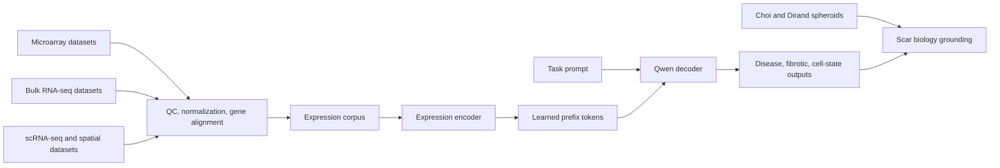

## Data Strategy

### Dataset 1: Microarray Disease-State Pretraining

Primary accessions:

- `GSE7890`
- `GSE92566`
- `GSE90051`
- `GSE44270`
- `GSE3189`
- `GSE145725`

These now provide 154 train-ready microarray expression profiles. `GSE145725` is included as a rescued fibroblast keloid-vs-normal dataset mapped from probes to gene symbols.

Primary tasks:

- `keloid_vs_normal`
- disease-state pretraining
- ECM/TGF-beta/hypoxia/remodeling module-score prediction
- held-out accession generalization

### Dataset 2: Bulk RNA-seq Phenotype Modeling

Expected contrasts:

- keloid vs normal
- lesional vs non-lesional
- keloid vs hypertrophic scar
- nodular vs extensive keloid
- metabolism-axis studies
- immune-axis studies

Use these for sample-level disease and phenotype prediction. Bulk RNA-seq should become the main bridge between simple disease labels and richer fibrotic activity programs.

Current train-ready bulk sources:

- `GSE158395`
- `GSE188952`
- `Sun_Burns`

These provide 50 train-ready bulk RNA-seq profiles. `Sun_Burns` remains Ensembl-ID based until an Ensembl-to-symbol mapping step is added.

Primary tasks:

- `keloid_vs_normal`
- `lesional_status`
- `scar_differential`
- `severity_or_morphotype`
- `metabolism_axis_score`
- `immune_axis_score`
- `fibrotic_activity`

### Dataset 3: scRNA-seq and Spatial Cell-State Modeling

Expected biology:

- fibroblast subclusters
- fibroblast/endothelial expansion
- fibrovascular communication
- `POSTN+` mesenchymal fibroblasts
- `IGFBP2+` anti-fibrotic fibroblasts

Use these datasets to learn cell-state programs that explain why some samples are fibrotic, anti-fibrotic, vascularized, or inflammatory.

Current train-ready scRNA/spatial sources:

- `GSE163973`: 53 pseudobulk profiles from 40,655 source cells.
- `GSE181297`: 7 sample-level scRNA/Visium pseudobulk profiles from 34,837 barcodes/spots.
- `GSE175866`: 2 keloid fibroblast-state pseudobulk profiles.
- `GSE160536`: 1 pooled out-of-domain scleroderma pseudobulk profile from 14,901 barcodes.

Together these provide 63 train-ready scRNA/spatial pseudobulk profiles.

Primary tasks:

- `cell_type`
- `cell_state`
- `fibroblast_subcluster`
- `pro_fibrotic_vs_anti_fibrotic`
- `fibroblast_endothelial_communication`
- spatial neighborhood or region labels where available

### Dataset 4: Spheroid Grounding and Validation

Existing spheroid sources:

- Choi: fibroblast:endothelial keloid spheroids, morphology, qPCR, and drug response.
- Dirand: fibroblast-only keloid spheroids deactivate in 3D.

These should not drive model training by themselves. They should biologically ground the expression model in fibrosis as it relates to abnormal scar healing, keloid formation, keloid maintenance, and 3D spheroid behavior.

The key grounding question is:

> Do the gene-expression programs learned from real keloid/scar datasets explain which spheroid conditions look fibrotic, deactivated, scar-like, vascularized, or drug-responsive?

Use cases:

- map Choi qPCR markers onto learned module scores
- test whether fibroblast:endothelial spheroids align with vascular/fibrotic programs
- test whether Dirand fibroblast-only spheroids align with deactivation or anti-fibrotic programs
- evaluate whether expression-derived scores help explain drug response
- keep the project tied to scar formation and healing biology, not only generic keloid-vs-normal classification

## Architecture

Adapt the existing encoder-decoder design from `../Encoder_Decoder_LLM`:

- expression encoder consumes continuous gene-expression vectors
- encoder produces learned prefix tokens
- Qwen decoder consumes prefix tokens plus task prompt
- decoder generates disease, phenotype, cell-state, or response labels



Reusable source code:

- `../Encoder_Decoder_LLM/scripts/encoder_decoder_qwen3.py`
- `../Encoder_Decoder_LLM/scripts/train_encoder_decoder_qwen3.py`
- `../Encoder_Decoder_LLM/scripts/mlp_encoder.py`
- `../Encoder_Decoder_LLM/scripts/merge_foundation_h5ad.py`

Initial model configuration:

- decoder: `Qwen/Qwen3-1.7B`
- encoder types to compare: MLP, attentive pooling, tiny transformer
- input: aligned gene-expression vector or cell-set embedding
- output: generated label text, with optional classification head for high-confidence benchmarks
- precision: bf16 on CUDA
- evaluation: held-out dataset/accession/patient splits

MVP baseline scope:

- prioritize elastic-net logistic regression, linear SVM, random forest/gradient boosting, module-score-only models, and a small MLP encoder.
- skip scGPT/Geneformer-style foundation-model baselines for the first MVP.
- only try the frozen-Qwen adapter after the basic baselines establish reliable signal.

Current expression corpus size:

- 267 train-ready expression profiles total.
- Microarray: 154 profiles.
- Bulk RNA-seq: 50 profiles.
- scRNA/spatial pseudobulk: 63 profiles.

Initial train run goal:

- Prove that the harmonized expression corpus contains a reproducible keloid/scar signal under leakage-safe grouped splits.
- Start with basic baselines on `modules_only`, `shared_genes`, and `shared_genes_plus_modules` feature sets.
- Use `keloid_binary` as the headline target and compare against majority-class/random baselines.
- Produce reusable feature matrices, split manifests, metrics, and error reports.
- Use the outcome to decide whether a small expression encoder or frozen-Qwen adapter is justified.

This first run is not intended to be a final disease predictor, a production model, or an end-to-end Qwen training run.

MVP safeguards:

- Build canonical target columns before training, especially `keloid_binary` as `keloid` vs `non_keloid`.
- Build shared feature matrices before modeling; do not train one model directly on separate modality-specific vocabularies.
- Use module-score-only and shared-gene-plus-module feature sets as the first reliable baselines.
- Keep out-of-domain datasets such as `GSE3189` and `GSE160536` out of headline keloid/scar validation metrics.
- Treat small tasks such as `fibroblast_state`, `scar_differential`, and out-of-domain fibrotic-state prediction as exploratory.
- Enforce grouped splits by accession, patient, or source sample so pseudobulk profiles from the same source sample never cross train/test boundaries.

Datasets intentionally not part of the main keloid/scar training corpus yet:

- `GSE125022`: useful DEG/DAR biological context, but uploaded files do not include train-ready sample-level RNA expression rows.
- `GSE202203`: large breast-tumor expression dataset; keep separate unless broad out-of-domain disease pretraining is explicitly added.

## Repository Layout

Target layout:

```text
SpheroScar/
├── PLAN.md
├── README.md
├── configs/
│   └── encoder_decoder.yaml
├── data/
│   ├── raw/
│   │   ├── microarray/
│   │   │   ├── GSE7890_series_matrix.txt.gz
│   │   │   ├── GSE92566_series_matrix.txt.gz
│   │   │   ├── GSE90051_series_matrix.txt.gz
│   │   │   ├── GSE44270_series_matrix.txt.gz
│   │   │   └── GSE3189_series_matrix.txt.gz
│   │   ├── bulk_rnaseq/
│   │   ├── scrna_spatial/
│   │   └── spheroid/
│   │       ├── choi/
│   │       └── dirand/
│   ├── processed/
│   │   ├── microarray/
│   │   │   ├── microarray_expression_wide.parquet
│   │   │   ├── microarray_X.npy
│   │   │   ├── microarray_gene_vocab.txt
│   │   │   └── signatures/
│   │   ├── bulk_rnaseq/
│   │   ├── scrna_spatial/
│   │   └── spheroid/
│   │       ├── dataset_a_keloid_spheroid.parquet
│   │       └── dataset_b_morphology.parquet
│   └── schemas/
│       ├── expression_features.yaml
│       ├── sample_metadata.yaml
│       └── targets.yaml
├── scripts/
│   ├── sourcing.py
│   ├── data_extraction.py
│   ├── preprocess_expression.py
│   ├── build_expression_corpus.py
│   ├── train_encoder_decoder.py
│   └── evaluate_encoder_decoder.py
├── notebooks/
│   └── expression_dataset_audit.ipynb
└── results/
    ├── expression_model/
    └── spheroid_transfer/
```

## Canonical Metadata

Every expression dataset should map into a shared metadata schema:

- `sample_id`
- `cell_id` where applicable
- `accession`
- `source_dataset`
- `platform`
- `modality`: `microarray`, `bulk_rnaseq`, `scrna_seq`, `spatial`, `qpcr`
- `patient_id`
- `batch`
- `tissue`
- `disease_label`: `keloid`, `normal`, `hypertrophic_scar`, `scar`, `unknown`
- `lesional_status`
- `scar_type`
- `severity_or_morphotype`
- `cell_type`
- `cell_state`
- `fibroblast_subcluster`
- `treatment`
- `drug`
- `response_label`

Expression features should be aligned by gene symbol, with a frozen gene vocabulary after the first corpus build.

For the MVP, create explicit feature sets:

- `modules_only`
- `shared_genes`
- `shared_genes_plus_modules`
- `within_modality` diagnostic matrices

Do not include Ensembl-only `Sun_Burns` features in shared-gene baselines until they are mapped to gene symbols.

## Module Scores

Use module scores both as interpretable labels and as sanity checks:

- ECM: `COL1A1`, `COL3A1`, `FN1`
- myofibroblast: `ACTA2`, `TAGLN`, `MYL9`
- TGF-beta: `TGFB1`, `TGFB3`, `TGFBR1`, `TGFBR2`, `SMAD2`, `SMAD3`
- hypoxia/vascular: `HIF1A`, `PECAM1`, `VWF`, `KDR`
- remodeling: `MMP14`, `ADAM12`, `HTRA1`, `CTHRC1`
- pro-fibrotic fibroblast: include `POSTN`
- anti-fibrotic fibroblast: include `IGFBP2`
- immune axis: dataset-specific cytokine/immune marker panels after metadata audit
- metabolism axis: dataset-specific metabolic panels after metadata audit

Normalize module scores within dataset/modality before cross-dataset comparisons.

## Training Tasks

### Supervised Label Generation

Prompt examples:

```text
Given this keloid expression profile, predict the disease state. Answer:
Given this fibroblast expression profile, predict the fibroblast state. Answer:
Given this bulk RNA-seq sample, predict whether it is lesional or non-lesional. Answer:
```

Outputs:

- `keloid`
- `normal`
- `hypertrophic_scar`
- `lesional`
- `non_lesional`
- `POSTN_positive_mesenchymal_fibroblast`
- `IGFBP2_positive_anti_fibrotic_fibroblast`

### Multi-Task Expression Modeling

Train with a mixture of tasks:

- canonical `keloid_binary` disease-state classification/generation
- scar differential classification
- lesional status prediction
- fibroblast state prediction
- module-score bin prediction
- dataset interpretation prompts

MVP task priority:

- headline: `keloid_binary`
- secondary: `lesional_status`, `cell_type`
- exploratory: `scar_differential`, `fibroblast_state`, out-of-domain disease/fibrotic-state labels, module-score regression

Validation task meanings:

- `keloid_binary`: headline keloid vs non-keloid benchmark across compatible keloid, scar, normal, adjacent-normal, and non-lesional profiles.
- `lesional_status`: secondary scar progression task distinguishing lesional, non-lesional, control, and new-keloid-formation states where available.
- `cell_type`: secondary scRNA pseudobulk task testing whether broad cell identity is recoverable without source-sample leakage.
- `scar_differential`: exploratory keloid vs hypertrophic scar vs normotrophic scar task, currently mostly limited to `GSE188952`.
- `fibroblast_state`: exploratory `GSE175866` sanity check for keloid fibroblast-state labels; too small for strong metrics.
- `out_of_domain_disease_state`: melanoma/nevus/normal skin expression task for OOD pretraining/sanity checks, not headline keloid validation.
- `out_of_domain_fibrotic_state`: pooled scleroderma pseudobulk sanity check, not a classifier benchmark.
- module-score regression/ranking: internal interpretability check for ECM, TGF-beta, hypoxia/vascular, remodeling, myofibroblast, `POSTN`, and `IGFBP2` programs.

### Spheroid Transfer

Use Choi/Dirand after expression-model training:

- compare Choi qPCR module scores to model-derived keloid programs
- score Dirand 2D vs 3D conditions as active vs deactivated
- test whether fibroblast:endothelial co-culture aligns with vascular/fibrotic programs
- treat drug response as a downstream task only if enough labeled spheroid rows exist

## Evaluation

Use splits that reflect real generalization:

- leave-one-accession-out for microarray
- leave-one-study-out across microarray/bulk RNA-seq
- leave-one-patient-out where patient metadata exist
- leave-one-source-sample-out for scRNA/spatial pseudobulk
- held-out scar contrast for keloid vs hypertrophic scar
- held-out cell-state labels for scRNA-seq/spatial
- final spheroid transfer evaluation on Choi/Dirand

Skip task/split combinations that do not contain at least two labels in both train and evaluation folds.

Metrics:

- accuracy
- macro F1
- weighted F1
- AUROC for binary tasks
- calibration for disease-state probabilities if using classification head
- confusion matrices by accession/modality
- module-score correlation against known marker programs
- spheroid transfer agreement with Choi/Dirand biology

## Post-MVP Frozen-Qwen Adapter Benchmark

After classical baselines establish leakage-safe `keloid_binary` signal, run a staged adapter search over the **189 eligible profiles** (not all 267; 78 are canonical `exclude`).

Split coverage:

- 15 grouped folds (`grouped_seed{0,1,2}_fold{0..4}`)
- 8 leave-one-accession-out folds (`leave_accession_out_*`)

Search space:

- encoder families: `mlp`, `tiny_transformer`, `attentive_pool`
- MLP/transformer depth: 2, 3, 4 layers
- training budget: `max_epochs` 10 or 15 with early stopping (`patience=3`)
- refinement knobs: prefix tokens, dropout, learning rate, transformer encoder dim

Benchmark target:

- beat `elastic_net_logreg` on `shared_genes_plus_modules`, mean grouped weighted F1 **0.654** (baseline std **0.179**)

Go/no-go criteria:

- **Proceed to prompt-conditioned Qwen** if grouped weighted F1 beats baseline, grouped std stays at or below baseline std, and LOSO weighted F1 is within ~0.05 of grouped mean
- **Hold and refine adapter** if grouped gains exist but LOSO/generalization is unstable
- **Hold Qwen decode** if adapter does not beat the baseline mean on grouped folds

Scripts:

- `scripts/train_frozen_qwen_adapter.py`: multi-split trainer with early stopping and JSONL logging
- `scripts/run_adapter_hyperparam_search.py`: Phase A pilot, Phase B refinement, Phase C full 23-split eval
- `scripts/write_adapter_eval_report.py`: grouped/LOSO aggregation and baseline comparison
- `scripts/run_adapter_search_misha_gpu.sbatch`: Slurm launcher with `WANDB_SILENT=true`

## Implementation Order

1. Inventory uploaded datasets and organize raw files under `data/raw/{microarray,bulk_rnaseq,scrna_spatial,spheroid}`.
2. Convert the dataset overview document to Markdown once needed and store it as project documentation.
3. Build `sample_metadata.yaml`, `expression_features.yaml`, and revised `targets.yaml`.
4. Implement `preprocess_expression.py` for microarray and bulk RNA-seq first.
5. Build `expression_corpus.h5ad` or matrix-plus-metadata artifacts.
6. Port the Qwen3 encoder-decoder code into SpheroScar-specific scripts.
7. Train microarray disease-state baseline.
8. Add bulk RNA-seq phenotype tasks.
9. Add scRNA-seq/spatial cell-state tasks.
10. Evaluate spheroid transfer using Choi/Dirand.

## Risks

| Risk | Mitigation |
|------|------------|
| Platform heterogeneity across microarray/bulk/scRNA | Normalize within modality first; evaluate leave-one-accession-out before mixing modalities. |
| Labels are inconsistent across studies | Keep raw labels, harmonized labels, and confidence/provenance columns. |
| Gene vocabularies differ by platform | Freeze a shared vocabulary plus module-score fallback features. |
| scRNA/spatial scale exceeds local resources | Start with fibroblast/endothelial subsets and sampled cell sets. |
| Spheroid labels remain small | Use spheroids as validation/grounding, not main supervised training. |
| Encoder-decoder training is expensive | Start with frozen decoder and train encoder/prefix layers first. |

## Deliverables

- dataset inventory and provenance manifest
- harmonized expression corpus
- SpheroScar encoder-decoder training script
- held-out accession/study evaluation report
- cell-state and module-score interpretation report
- spheroid transfer analysis linking expression programs to Choi/Dirand biology
