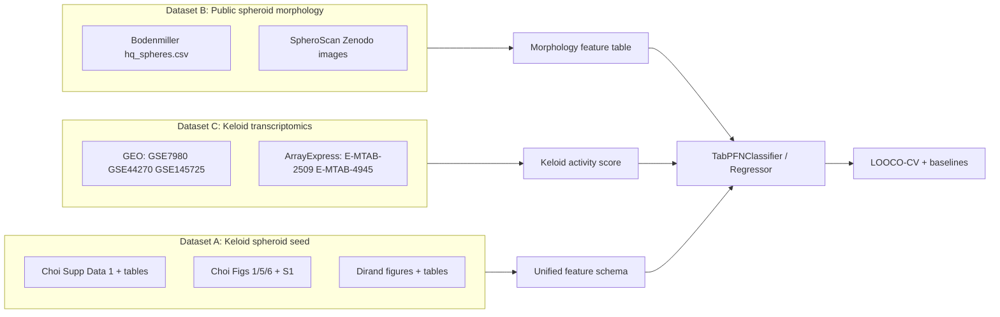

# Keloid Spheroid TabPFN MVP Plan

## Current state

- Project folder contains the two seed papers:
  - [`spheroid_1.pdf`](spheroid_1.pdf) — Dirand et al. 2023 (Biomedicines, DOI [10.3390/biomedicines11092350](https://doi.org/10.3390/biomedicines11092350)): KF vs NDF, 2D vs 3D, ±TGF-β1, deactivation phenotype
  - [`spheroid_2.pdf`](spheroid_2.pdf) — Choi et al. 2024 (Communications Biology, DOI [10.1038/s42003-024-07194-2](https://doi.org/10.1038/s42003-024-07194-2)): co-culture keloid spheroids, morphology, qPCR, drug response
- TabPFN is available locally at [`../0shot_Tabular Inference/TabPFN/`](../0shot_Tabular%20Inference/TabPFN/) (v8.0.7); no spheroid-specific code exists yet.

## Architecture



## Proposed repo layout

```
Spheroid Fibrosis Model/
├── PLAN.md                    # this file
├── spheroid_1.pdf             # Dirand 2023
├── spheroid_2.pdf             # Choi 2024
├── data/
│   ├── raw/
│   │   ├── choi/              # Supplementary Data 1, tables, figure PNGs
│   │   ├── dirand/            # MDPI supplementary + figure PNGs
│   │   ├── bodenmiller/       # Zenodo 4271910 processed exports
│   │   ├── spheroscan/        # Zenodo 7555467 / 8211845
│   │   └── keloid_geo/        # GEO SOFT + ArrayExpress matrices
│   ├── processed/
│   │   ├── dataset_a_keloid_spheroid.parquet
│   │   ├── dataset_b_morphology.parquet
│   │   ├── dataset_c_keloid_signature.parquet
│   │   └── keloid_activity_score.parquet
│   └── schemas/
│       ├── features.yaml      # canonical column names + dtypes
│       └── targets.yaml       # label definitions per task
├── scripts/
│   ├── 01_download_sources.py
│   ├── 02_extract_choi_dirand.py
│   ├── 03_build_morphology_table.py
│   ├── 04_build_keloid_signature.py
│   ├── 05_harmonize_features.py
│   └── 06_train_tabpfn.py
├── notebooks/
│   ├── 01_digitize_figures.ipynb
│   └── 02_mvp_evaluation.ipynb
├── configs/
│   └── mvp.yaml
├── requirements.txt
└── README.md
```

## Phase 1 — Dataset A: Keloid spheroid seed (Choi + Dirand)

**Goal:** One harmonized long-format table where each row is a biological replicate (or condition mean when only aggregate data exist).

### 1A. Download structured sources first

| Source | What to pull | Priority |
|--------|--------------|----------|
| Choi supplementary | **Supplementary Data 1** (source data behind graphs), Supplementary Table 1 (cell sources), primer list | Highest — may already be tabular |
| Choi article page | Figs 1, 5, 6; Supp Fig S1 | Fallback digitization |
| Dirand MDPI page | Supplementary figures/tables (apoptosis, α-SMA, fibronectin, COL1A1/COL3A1, COL1A1/COL3A1 ratio) | High |

### 1B. Canonical schema (`features.yaml`)

**Metadata columns (categorical):**
- `paper`: `choi_2024` | `dirand_2023`
- `cell_source`: `ATCC_KF`, `K1`, `K2`, `K3`, `NDF`, `NF`, `HUVEC`
- `culture_format`: `2D`, `3D_spheroid`
- `fb_ec_ratio`: `1:0`, `8:1`, `4:1`, `2:1`, `1:1`, `NA`
- `tgfb1`: `none`, `present`
- `drug`: `vehicle`, `triamcinolone`, `5FU`, `bleomycin`
- `day`: integer (0–14+)
- `replicate_id`, `experiment_id`

**Numeric features:**
- Morphology: `spheroid_area`, `spheroid_volume`, `diameter`, `relative_volume_vs_vehicle`
- Viability: `viability_2d`, `viability_3d`
- qPCR (ΔCt or fold-change): `COL1A1`, `COL3A1`, `TGFB1`, `TGFB3`, `HIF1A`, `MMP14`, `HTRA1`, `ADAM12`, `CTHRC1`
- Dirand-specific: `apoptosis`, `alpha_SMA`, `fibronectin`, `COL1A1_COL3A1_ratio`, `CD26`

**Target labels (separate tasks, not all rows have all labels):**
- `fibrotic_state`: `active_fibrotic` | `deactivated` (Dirand: 2D KF active, 3D KF deactivated; Choi: co-culture preserves fibrotic markers)
- `spheroid_state`: `aggregate` | `pre_compaction` | `compact` | `pre_regression` | `regression`
- `drug_response_class`: `sensitive` | `resistant` (from relative volume vs vehicle thresholds in Fig 6)
- `drug_response_continuous`: relative volume or diameter ratio

### 1C. Extraction workflow

1. **Automated parse** — XLSX/CSV from Choi Supplementary Data 1 and Dirand supplements via `pandas`.
2. **Semi-automated digitization** — For bar/line plots without raw tables, export figure PNGs and digitize with WebPlotDigitizer or a small `digitize_figures.ipynb`; store provenance (`source_file`, `figure_panel`, `digitized_by`).
3. **Unit normalization** — Convert all morphology to consistent units (μm² area, μm diameter); qPCR to log2 fold-change vs control where possible.
4. **Quality checks** — Cross-check digitized means against paper-reported significance; flag conditions with n < 3.

**Expected size:** ~50–200 rows (small but biologically clean). Choi methods: ≥5 spheroids/condition × 3 biological repeats.

---

## Phase 2 — Dataset B: Public spheroid morphology pretraining

**Goal:** Larger tabular dataset for morphology/state prediction and pipeline testing.

### 2A. Bodenmiller (primary)

- **Raw/processed:** [Zenodo 4271910](https://doi.org/10.5281/zenodo.4271910) (physiology analysis); companion repo [BodenmillerGroup/SpheroidPublication](https://github.com/BodenmillerGroup/SpheroidPublication)
- **Key artifact:** `results/hq_spheres.csv` — area, diameter, circularity, well/plate metadata
- **Optional aggregation:** Per-spheroid single-cell summaries from 229k cells (cell line, treatment, density) if exporting from their Colab notebook
- **Targets:** `misformed` flag, size quantiles, treatment response proxies

### 2B. SpheroScan (secondary)

- **Images:** [Zenodo 7555467](https://doi.org/10.5281/zenodo.7555467), external test [8211845](https://doi.org/10.5281/zenodo.8211845)
- **Tool:** [FunctionalUrology/SpheroScan](https://github.com/FunctionalUrology/SpheroScan) to batch-segment images → area, diameter, circularity CSV
- **Use case:** Validate image→tabular extraction pipeline analogous to future in-house spheroid imaging

### 2C. Harmonization to shared morphology columns

Map Bodenmiller + SpheroScan into: `area`, `diameter`, `circularity`, `cell_line`, `treatment`, `day`, `source_dataset`. Keep keloid-specific columns empty/NA.

**Expected size:** 1k–10k+ rows.

---

## Phase 3 — Dataset C: Public keloid transcriptomic signature

**Goal:** Derive a compact **keloid activity score** from in vivo/in vitro tissue expression, then use it as features or a secondary validation target for spheroid rows that have overlapping qPCR markers.

### 3A. Download GEO/ArrayExpress

| Accession | Content |
|-----------|---------|
| GSE7980 | Keloid fibroblast expression |
| GSE44270 | KF vs NF keratinocytes + fibroblasts |
| GSE145725 | KF vs NF (19 samples) |
| E-MTAB-2509, E-MTAB-4945 | ArrayExpress keloid sets |

Use `GEOparse` + `pandas`; harmonize gene symbols to HGNC.

### 3B. Marker panels (aligned with Choi qPCR)

Build module scores for:
- **ECM:** COL1A1, COL3A1, FN1
- **Myofibroblast:** ACTA2
- **TGF-β:** TGFB1, TGFB3, TGFBR2
- **Hypoxia/vascular:** HIF1A, PECAM1/VWF (where present)
- **Remodeling:** MMP14, ADAM12, HTRA1, CTHRC1

Methods: mean z-scored expression per module → composite `keloid_activity_score`; binary `keloid_vs_normal` per sample.

### 3C. Bridge to spheroids

For Dataset A rows with qPCR values, compute Pearson/Spearman correlation between spheroid marker values and public keloid module scores. This answers: *does this in vitro spheroid resemble public in vivo keloid tissue?*

**Expected size:** ~50–150 samples (Dataset C); score is a derived 5–10 column feature vector reusable across tasks.

---

## Phase 4 — TabPFN integration and evaluation

Leverage existing local TabPFN API ([`../0shot_Tabular Inference/TabPFN/examples/tabpfn_for_binary_classification.py`](../0shot_Tabular%20Inference/TabPFN/examples/tabpfn_for_binary_classification.py)):

```python
from tabpfn import TabPFNClassifier, TabPFNRegressor
```

### 4A. Three training modes

| Mode | Train data | Test data | Task |
|------|------------|-----------|------|
| **A-only** | Dataset A (Choi+Dirand) | Leave-one-condition-out (LOOCO) CV | `fibrotic_state`, `spheroid_state`, `drug_response` |
| **B→A transfer** | Dataset B morphology features | Dataset A morphology-only rows | Does public morphology generalize to keloid spheroid state? |
| **C-augmented** | A qPCR rows + C module scores as extra features | LOOCO on A | Keloid signature improves drug/state prediction? |

### 4B. Evaluation protocol (critical for small n)

- **Never use random row splits** on Dataset A — leaks condition structure.
- Use **LOOCO grouped by** `(cell_source, fb_ec_ratio, drug, day)` or leave-one-patient-out for K1/K2/K3.
- Baselines: logistic regression, LightGBM (already a TabPFN dep), majority class.
- Metrics: AUROC (binary), macro-F1 (multiclass), MAE (drug response regression).
- Report **calibration** and **feature ablation** (morphology-only vs qPCR-only vs combined).

### 4C. `06_train_tabpfn.py` outputs

- `results/mvp_metrics.json`
- `results/predictions_looco.csv`
- `results/feature_importance_proxy.csv` (permutation on small n)

---

## Phase 5 — Integration narrative (the "connect them" step)

End-to-end hypothesis test:

1. **Bodenmiller/SpheroScan** teaches which morphology features predict spheroid quality/state at scale.
2. **GEO keloid signature** defines what "keloid-like" means at the gene-expression level.
3. **Choi/Dirand** tests whether low-cost tabular features (ratio, day, area, a few qPCR markers) predict:
   - fibrotic vs deactivated (Dirand contrast),
   - compact vs regressed (Choi morphology trajectory),
   - drug sensitivity (Choi Fig 6).

Deliverable: a short results table showing which feature groups carry signal under LOOCO — enough to justify collecting new wet-lab data or digitizing more figures.

---

## Dependencies

`requirements.txt` (minimal):

- `pandas`, `pyarrow`, `numpy`, `scipy`
- `GEOparse`, `requests`, `openpyxl`
- `matplotlib`, `seaborn`
- `scikit-learn`
- `pyyaml`
- `tabpfn` (or editable install from local clone)
- Optional: `opencv-python`, SpheroScan deps for image pipeline

---

## Risks and mitigations

| Risk | Mitigation |
|------|------------|
| Choi Supplementary Data 1 incomplete | Digitize Figs 1/5/6 + S1; document uncertainty columns |
| Very small n breaks ML | LOOCO + baselines; treat as prototype, not production model |
| Cross-dataset feature mismatch | Strict `features.yaml`; NA for missing columns, never drop rows silently |
| Bodenmiller is IMC/cell-line, not keloid | Use only for morphology pipeline validation, not keloid label training |
| GEO platform heterogeneity | ComBat or per-dataset z-scores before meta-signature |

---

## Suggested implementation order

1. Scaffold repo + schemas + download script
2. Extract Dataset A (Choi supp first, then Dirand, then figure digitization)
3. Run TabPFN A-only LOOCO baseline (fast sanity check)
4. Build Dataset B morphology table (Bodenmiller CSV first; SpheroScan optional)
5. Build Dataset C keloid signature from GEO
6. Run B→A and C-augmented experiments
7. Notebook summary + decide next wet-lab / data-collection priorities
