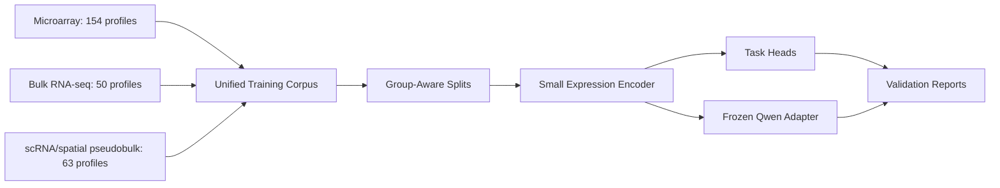

# SpheroScar 267-Profile Training Plan

## Dataset Scope
Use the current encoder-ready artifacts:

- `data/processed/microarray/microarray_*`: 154 profiles, 50,478 genes
- `data/processed/bulk_rnaseq/bulk_rnaseq_*`: 50 profiles, 10,016 genes
- `data/processed/scrna_spatial/scrna_spatial_*`: 63 profiles, 10,002 genes

Total: 267 train-ready profiles. Treat these as expression profiles, not independent raw cells. The single-cell and spatial datasets are represented through leakage-safe pseudobulk profiles where possible.

## Initial Train Run Goal
The first training run is not meant to produce a final biological discovery model. Its goal is to prove that the processed corpus contains a reproducible, leakage-safe keloid/scar signal that a simple model can learn.

Primary objective:

- Train basic baselines on harmonized `modules_only`, `shared_genes`, and `shared_genes_plus_modules` feature sets.
- Validate whether `keloid_binary` can generalize across grouped splits better than chance and better than trivial majority-class prediction.
- Identify which feature set and split protocol are stable enough to justify a small neural encoder.

Success criteria:

- A linear or tree-based baseline beats majority-class and random baselines on grouped `keloid_binary` validation.
- Performance remains plausible under leave-one-study-out or other grouped evaluation, not only random splits.
- Failure cases are interpretable by accession, modality, and label type.
- The run produces reusable split manifests, feature matrices, metrics, and error reports for the next model stage.

Non-goals for this first run:

- Do not claim production-grade disease prediction.
- Do not train Qwen end-to-end.
- Do not use tiny exploratory tasks as headline evidence.
- Do not treat pseudobulk profiles from the same source sample as independent patients.

Current train-ready sources:

- Microarray: `GSE7890`, `GSE92566`, `GSE90051`, `GSE44270`, `GSE3189`, and rescued `GSE145725`.
- Bulk RNA-seq: `GSE158395`, `GSE188952`, and `Sun_Burns`.
- scRNA/spatial pseudobulk: `GSE163973`, `GSE181297`, `GSE175866`, and pooled out-of-domain `GSE160536`.

Known limitations:

- `GSE125022` currently contributes DEG/DAR biological context, not train-ready sample-level expression, because the uploaded series matrix lacks RNA expression rows.
- `GSE202203` remains excluded from the keloid/scar corpus as a breast-tumor out-of-domain dataset unless broad disease pretraining is explicitly added.
- `Sun_Burns` is train-ready but remains Ensembl-ID based until an Ensembl-to-gene-symbol mapping step is added.
- The current modality artifacts do not yet form one shared feature matrix. Baselines must train on a harmonized gene/module feature table, not directly on separate modality-specific matrices.
- Some labels are detailed states such as `normal_scar` or `adjacent_normal`; headline binary metrics must use a canonical `keloid_binary` target.

## Validation Tasks
Primary task:

- `keloid_binary`: main benchmark, derived from detailed labels as `keloid` vs `non_keloid`. This is the clearest biological question and the best-supported cross-modality label. Validate accuracy, weighted F1, balanced accuracy, macro-F1, AUROC where binary labels are clean, and calibration.

Secondary tasks:

- `lesional_status`: distinguish lesional, non-lesional, control/new-formation states. Useful for scar progression, but smaller and label definitions vary by study.
- `cell_type`: validate whether the encoder learns scRNA-derived cell programs from pseudobulk profiles. Use only grouped patient/sample splits.
- `fibroblast_state`: exploratory, currently only 2 direct profiles from `GSE175866`, so use as qualitative/held-in sanity check rather than headline performance.
- `scar_differential`: keloid vs hypertrophic scar vs normotrophic scar from bulk RNA-seq. Very small, report as exploratory.
- `out_of_domain_disease_state`: melanoma/nevus/normal microarray task. Use for expression pretraining and OOD sanity checks, not as keloid model success.
- `fibrotic_activity_score` and module scores: use as auxiliary regression/self-supervised targets from computed ECM, TGF-beta, hypoxia, remodeling, myofibroblast, and vascular scores.

Detailed validation task definitions:

1. `keloid_binary`
   - Question: can the model distinguish keloid-derived expression profiles from non-keloid scar/normal/adjacent-normal profiles?
   - Positive class: `keloid`.
   - Negative class: compatible `normal`, `normal_scar`, `adjacent_normal`, `non_lesional`, and control-like profiles.
   - Supported by: `GSE7890`, `GSE145725`, `GSE158395`, `Sun_Burns`, `GSE163973` all-cell pseudobulk, and `GSE181297`.
   - Exclude from headline: OOD melanoma/nevus and pooled scleroderma.
   - Metrics: accuracy, weighted F1, balanced accuracy, macro-F1, AUROC, confusion matrix.
   - Role: headline MVP task.

2. `lesional_status`
   - Question: within keloid/scar-relevant samples, can the model distinguish lesional, non-lesional, control, or new-keloid-formation states?
   - Supported by: mainly `GSE44270`, `GSE92566`, and `GSE158395`.
   - Risk: definitions differ by study, so this should not be merged blindly with generic normal-vs-keloid labels.
   - Metrics: accuracy, weighted F1, balanced accuracy, macro-F1, confusion matrix.
   - Role: secondary scar-progression task.

3. `cell_type`
   - Question: can expression profiles from scRNA pseudobulk recover broad cell identity such as Fibroblast, Endothelial, Keratinocyte, Immune cell, and related states?
   - Supported by: `GSE163973` pseudobulk profiles.
   - Split rule: leave one source sample/patient out, such as `KF1`, `KF2`, `KF3`, `NF1`, `NF2`, or `NF3`.
   - Risk: these are pseudobulk cell-type profiles, not independent patients.
   - Metrics: accuracy, weighted F1, balanced accuracy, macro-F1, confusion matrix, per-source-sample breakdown.
   - Role: secondary representation-learning task.

4. `scar_differential`
   - Question: can the model distinguish keloid, hypertrophic scar, and normotrophic scar profiles?
   - Supported by: mainly `GSE188952`.
   - Risk: very small sample count and mostly one study, so this cannot support strong generalization claims.
   - Metrics: accuracy, weighted F1, balanced accuracy, macro-F1, confusion matrix when valid.
   - Role: exploratory.

5. `fibroblast_state`
   - Question: can the model distinguish the two uploaded keloid fibroblast-state pseudobulk profiles, including CD266+/CD9- fibroblasts versus other keloid fibroblasts?
   - Supported by: `GSE175866`.
   - Risk: only 2 profiles, so no reliable held-out metric.
   - Metrics: qualitative prediction check only; accuracy/weighted F1 may be shown only as sanity-check numbers.
   - Role: exploratory biological sanity check.

6. `out_of_domain_disease_state`
   - Question: can the representation separate unrelated disease states such as melanoma, nevus, and normal in out-of-domain skin expression?
   - Supported by: `GSE3189`.
   - Use: representation pretraining, OOD detection, and sanity checking.
   - Exclude from headline keloid/scar metrics.
   - Metrics: accuracy, weighted F1, balanced accuracy, macro-F1, confusion matrix.
   - Role: OOD auxiliary task.

7. `out_of_domain_fibrotic_state`
   - Question: can the corpus represent a non-keloid fibrotic skin condition such as scleroderma?
   - Supported by: pooled `GSE160536` all-cell pseudobulk.
   - Risk: only 1 pooled profile, so it cannot be evaluated as a real classifier task.
   - Metrics: qualitative embedding/proximity check only.
   - Role: OOD fibrosis sanity check.

8. Module-score regression or ranking
   - Question: do model embeddings preserve known fibrosis-related programs such as ECM, TGF-beta, hypoxia/vascular, remodeling, myofibroblast, `POSTN`, and `IGFBP2` activity?
   - Supported by: all profiles with mapped genes for the relevant modules.
   - Risk: module scores are derived from the same expression features, so this is an internal consistency check, not external validation.
   - Metrics: MAE, RMSE, Spearman correlation, Pearson correlation.
   - Role: interpretability and quality-control task.

Do not treat all tasks equally in MVP reporting:

- Headline: `keloid_binary`.
- Secondary: `lesional_status` and `cell_type`.
- Exploratory only: `scar_differential`, `fibroblast_state`, `out_of_domain_disease_state`, and module-score regression.

## Feature Harmonization
Before any baseline training, build a training-ready feature table from the modality artifacts:

- Create a unified manifest with one row per profile and canonical targets.
- Create a shared gene-symbol matrix using only genes that can be aligned confidently across modalities.
- Keep module scores as separate low-dimensional features for module-score-only and hybrid baselines.
- Treat `Sun_Burns` Ensembl-ID features separately until they are mapped to gene symbols; either exclude them from shared-gene baselines or include them only in module/within-dataset analyses.
- Preserve modality-specific matrices for ablation, but do not mix them directly in one model without explicit feature alignment.

Recommended first feature sets:

- `modules_only`: fibrosis/module scores plus metadata-safe covariates.
- `shared_genes`: common gene-symbol features across usable modalities after removing Ensembl-only features.
- `shared_genes_plus_modules`: shared genes concatenated with module scores.
- `within_modality`: modality-specific ablations used only for diagnostics.

## Split Strategy
Do not use a naive random row split as the main result. Use three split levels:

1. Development split: repeated grouped train/val/test.
   - Prefer repeated grouped splits over one fixed 70/15/15 split because accession counts are small.
   - Group by `accession` when patient IDs are unavailable.
   - Group by `patient_id` when patient/source IDs are available.
   - Group by `patient_id` for scRNA pseudobulk.
   - Keep all pseudobulk profiles from the same `KF*` or `NF*` source sample in the same split.
   - Verify every split has at least two classes for the active task; otherwise skip that split for that task.

2. Leave-one-study-out evaluation.
   - Train on all but one accession/modality source.
   - Test on the held-out accession.
   - This is the honest generalization check for `keloid_binary` and `lesional_status` where the held-out study has compatible labels.

3. Leave-one-patient-out scRNA evaluation.
   - For `GSE163973`, hold out one of `KF1`, `KF2`, `KF3`, `NF1`, `NF2`, `NF3` at a time.
   - For `GSE181297`, hold out one source sample such as `Ke01`, `Ke02`, `Pt1`, `Pt2`, `NS02`, `NSV1`, or `NSV2`.
   - Validate `cell_type`, all-cell `keloid_vs_normal`, and spatial/scRNA pseudobulk tasks without leakage.

4. Out-of-domain handling.
   - Keep `GSE3189` and `GSE160536` available for representation pretraining or OOD sanity checks.
   - Do not include OOD-only labels in the headline keloid/scar test metric.

5. Task-specific split rules.
   - `keloid_binary`: use grouped development splits plus leave-one-study-out where labels remain binary-compatible.
   - `lesional_status`: evaluate only on studies with lesional/non-lesional/control labels; do not force unrelated datasets into this target.
   - `cell_type`: evaluate with leave-one-patient/source-sample-out on `GSE163973`; do not mix all profiles from the same source sample across folds.
   - `scar_differential`: report exploratory cross-validation only because the task is mostly from `GSE188952`.
   - `fibroblast_state` and `out_of_domain_fibrotic_state`: report as sanity checks only, not performance benchmarks.

Recommended headline reporting:

- Main result: grouped and leave-one-study-out `keloid_binary` performance.
- Secondary result: grouped dev-split multitask performance.
- Cell-state result: leave-one-patient-out `cell_type` performance on scRNA pseudobulk.
- Exploratory result: scar differential and fibrotic module-score prediction.

## Baseline Ladder
Run basic baselines in increasing complexity before treating any encoder-decoder model as the main model:

1. Classical tabular/expression baselines.
   - Logistic regression with elastic net.
   - Linear SVM.
   - Random forest or gradient boosting on selected genes/module scores.
   - k-nearest neighbors as a weak expression-space sanity check.

2. Small neural baselines.
   - MLP encoder with task-specific classification heads.
   - Denoising autoencoder pretraining followed by task heads.
   - Tiny transformer or Perceiver-style encoder over top genes.
   - Multitask encoder trained jointly on `keloid_vs_normal`, `lesional_status`, `scar_differential`, and `cell_type`.

3. Gene-program baselines.
   - Fibrosis/module-score-only model using ECM, TGF-beta, hypoxia, remodeling, myofibroblast, vascular, `POSTN`, and `IGFBP2` scores.
   - Pathway or gene-set averaged features to test whether simple biology captures most of the signal.

4. Expression-language baselines.
   - Frozen Qwen decoder with expression-derived prompt labels only, no learned encoder, as a language-only control.
   - Expression encoder plus frozen Qwen prefix/adapter.
   - LoRA or prefix tuning only after simpler baselines establish signal.

The key comparison is not just absolute performance. Each heavier baseline must beat simpler models under the same group-aware split before it becomes worth using in the final architecture.

## Model Training Approach
Start with the baseline ladder before Qwen:

- Stage 0: build canonical targets and shared feature matrices.
- Stage 1: train classical and module-score baselines to establish a minimum useful signal.
- Stage 2: train small neural encoders and compare against classical models.
- Stage 3: train the MVP encoder-decoder where the expression encoder produces prefix tokens, Qwen stays frozen, and only adapter/prefix plus small heads are trained.

Use augmentation only inside the training fold:

- gene dropout
- Gaussian expression noise
- mixup within same task/label where biologically sensible
- masked-gene reconstruction as an auxiliary objective

Never augment validation or test profiles, and never allow synthetic variants of a held-out sample into training.

## Evaluation Outputs
Produce a compact report per split:

- per-task sample counts
- label balance
- confusion matrix
- accuracy for every classification validation task
- weighted F1 for every classification validation task
- balanced accuracy
- macro-F1
- AUROC for binary tasks
- per-accession and per-modality breakdown
- failure cases with sample IDs/accessions

Minimum metrics by task:

- `keloid_binary`: accuracy, weighted F1, balanced accuracy, macro-F1, AUROC, confusion matrix.
- `lesional_status`: accuracy, weighted F1, balanced accuracy, macro-F1, confusion matrix.
- `cell_type`: accuracy, weighted F1, balanced accuracy, macro-F1, confusion matrix, per-patient breakdown.
- `scar_differential`: accuracy, weighted F1, balanced accuracy, macro-F1, confusion matrix.
- `fibroblast_state`: accuracy and weighted F1 only as qualitative sanity checks because there are too few samples for reliable held-out metrics.
- `out_of_domain_disease_state`: accuracy, weighted F1, balanced accuracy, macro-F1, confusion matrix.
- module-score or `fibrotic_activity_score` regression: MAE, RMSE, Spearman correlation, Pearson correlation.

## Key Decision
The first training milestone should answer: can a basic baseline learn a leakage-safe `keloid_binary` signal from harmonized expression/module features better than chance across grouped splits? Only after that should we scale to a small neural encoder or frozen-Qwen adapter.